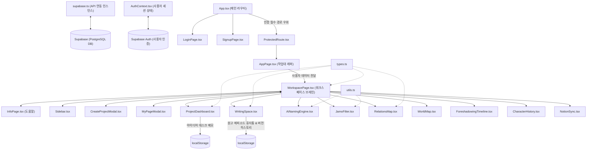

# 노벨플로우(Novelflow) 시스템 아키텍처 통합 명세서
(Global System Architecture, Directory Relations, and Database Schema Specifications)

이 문서는 노벨플로우(Novelflow) 서비스의 전체 개발 환경 스택, 클라이언트 소스 파일 구조 및 컴포넌트 간 데이터 흐름 관계, 그리고 PostgreSQL 기반 데이터베이스 스키마 및 보안 RLS/Edge Function 설계 규격을 설명하는 시스템 마스터 엔지니어링 문서입니다.

---

## 1. 개발 기술 스택 (Technology Stack Spec)

### 1-1. 클라이언트 및 데스크톱 스택
*   **Tauri (Rust + React / TypeScript)**: 데스크톱 기반 Always-on-Top 미니 위젯 런타임을 구동하는 경량 바이너리 프레임워크.
*   **React & Tailwind CSS (v4)**: 고성능 SPA 클라이언트 렌더링 및 모던 글래스모피즘 UI 스타일링 정의.
*   **Supabase Client SDK**: BaaS 데이터 레이어와 클라이언트 간의 직접 데이터 트랜잭션 수립.
*   **Leaflet.js & Leaflet-Geoman (react-leaflet)**: 가상 좌표계(`CRS.Simple`) 기반 대형 지도 캔버스 핸들링 및 다각형(영역), 선(경로), 꼭짓점 드로잉 지원.
*   **html2canvas / leaflet-image**: 브라우저 상의 지도를 고해상도 PNG 이미지 파일로 클라이언트 캡처 및 익스포트.
*   **Zustand**: 계층형 지도 노드 트리 정보 및 타임라인 동적 스냅샷 이동용 경량 전역 상태 관리 라이브러리.

### 1-2. 백엔드 및 BaaS (Supabase) 스택
*   **Supabase Database (PostgreSQL / pgvector)**: 원고 에피소드 저장, 캐릭터 설정 및 RAG용 임베딩 데이터(pgvector) 통합 관리.
*   **Supabase Realtime**: Tauri 데스크톱 위젯과 웹 브라우저 에디터 간의 작성 내용 실시간 데이터 양방향 싱크.
*   **Supabase Edge Functions (Deno / TypeScript)**: 외부 API(Notion, 맞춤법 검사, AI 작명 등)와의 연동 및 결제 웹훅 수신을 위한 서버리스 로직 실행.
*   **Supabase Auth**: 소셜 및 게스트 가상 계정 로그인 제공.

### 1-3. AI API 가격 분석
*   **GPT-4o-mini**: $0.15 / 1M input. 일반 작명 및 단순 엑스트라 작명 제안용.
*   **Claude 3.5 Sonnet**: $3.00 / 1M input. 주요 캐릭터 묘사 및 문장 보완 전용.

### 1-4. Notion API 양방향 동기화 규격
*   **인증 보관**: OAuth 2.0으로 취득한 Access Token은 Supabase Vault 암호화 저장소에 격리 보관.
*   **Rate Limit 제어**: Supabase Edge Functions 단에서 Redis Queue 버퍼를 구축하여 Notion API 제한 규격인 **초당 2회(2 rps)** 속도를 지연(Jitter) 및 지수 백오프와 연계하여 준수함.

---

## 2. 프로젝트 디렉터리 및 컴포넌트 아키텍처

### 2-1. 전체 디렉터리 트리 (Project File Tree)
```
C:/project/noteandname/
├── index.html                        # 웹 진입점 HTML
├── package.json                      # 프로젝트 빌드 스크립트 및 의존성 라이브러리 목록
├── tsconfig.json                     # TypeScript 글로벌 컴파일러 옵션
├── vite.config.ts                    # Vite 빌드 및 개발 서버 설정
├── Documents/                        # 기획 및 참고용 스펙 문서 폴더
└── src/                              # 클라이언트 소스 코드 메인 디렉터리
    ├── main.tsx                      # React 마운트 진입점
    ├── App.tsx                       # 라우팅 제어 및 최상위 컴포넌트
    ├── App.css                       # 공통 스타일 파일
    ├── index.css                     # 코어 디자인 시스템 정의 (다크 모드, 글래스모피즘 등)
    │
    ├── lib/
    │   └── supabase.ts               # Supabase 클라이언트 인스턴스 초기화
    │
    ├── context/
    │   └── AuthContext.tsx           # 인증 세션 관리 및 게스트 우회 제어
    │
    ├── pages/
    │   ├── LoginPage.tsx             # 로그인 화면 (이메일 및 게스트 계정 로그인)
    │   ├── SignupPage.tsx            # 회원 가입 화면
    │   ├── AppPage.tsx               # 애플리케이션 작업대 진입 래퍼 페이지
    │   ├── WorkspacePage.tsx         # 워크스페이스 코어 (프로젝트 선택 및 서브 도구 라우터)
    │   └── InfoPage.tsx              # 서비스 매뉴얼 및 가이드 화면
    │
    └── components/
        ├── ProtectedRoute.tsx        # 인증 게이트웨이
        ├── Header.tsx                # 랜딩 페이지 상단 헤더
        ├── Hero.tsx                  # 랜딩 페이지 Hero 섹션
        ├── Features.tsx              # 랜딩 페이지 기능 카드 영역
        ├── Footer.tsx                # 랜딩 페이지 푸터
        ├── Sidebar.tsx               # 작업 영역 좌측 네비게이션바
        ├── CreateProjectModal.tsx    # 새 프로젝트 생성 모달
        ├── MyPageModal.tsx           # 마이페이지 모달
        │
        └── workspace/                # 개별 프로젝트 내부 창작 지원 서브 컴포넌트군
            ├── types.ts              # 프로젝트/에피소드/관계도 데이터 규격 정의
            ├── utils.ts              # 한글 자모 쪼개기 및 Levenshtein 유사도 분석 유틸
            ├── ProjectDashboard.tsx  # 프로젝트 대시보드 및 실시간 저장 메모장
            ├── WritingSpace.tsx      # 리치 에디터 집필실 및 이력 스냅샷/찾기바꾸기
            ├── AiNamingEngine.tsx    # AI 작명 및 유사도 충돌 사전 필터링
            ├── JamoFilter.tsx        # 실시간 캐릭터 발음 자모 비교 분석 샌드박스
            ├── RelationsMap.tsx      # 캐릭터 드래그 캔버스 및 SVG 관계선 연동
            ├── WorldMap.tsx          # 시점 슬라이더 기반 인터랙티브 세계관 지도
            ├── ForeshadowingTimeline.tsx # 미회수 복선 예방 챕터 타임라인 목록
            ├── CharacterHistory.tsx  # 회차 진행별 주요 인물 로그 추적 리스트
            └── NotionSync.tsx        # 노션 DB 연동 상태 모니터링 뷰
```

### 2-2. 파일별 역할 및 상세 기능
*   **`App.tsx`**: `react-router-dom` 라우팅 경로 관리 및 보호(ProtectedRoute) 여부 판별.
*   **`AuthContext.tsx`**: 로그인 사용자 세션 정보 관리. 로컬스토리지 임시 게스트 계정 정보(`guest-user-id`)를 제어하여 진입을 우회 처리.
*   **`WorkspacePage.tsx`**: 애플리케이션의 데이터 브레인. 프로젝트 상태, 에피소드 데이터, 등장인물 정보 및 탭 상태(`activeFeature`)를 한 곳에서 관리하며 하위 컴포넌트들에게 데이터 Props 전송을 책임짐.
*   **`utils.ts`**: 초성/중성/종성 유니코드 오프셋 역산 알고리즘 및 Levenshtein 편집 거리 연산 함수 내장.
*   **`WritingSpace.tsx`**: 에디터 본문, 폰트 업로드, 10분/1000자 자동 스냅샷 수집 스케줄러, 찾기 및 바꾸기 모듈을 내장한 핵심 집필 환경.
*   **`WorldMap.tsx`**: 계층 구조 지도 모델링 연동 및 타임라인 슬라이더 변화에 대응하는 SVG 마커 시각화 지도 캔버스.

### 2-3. 컴포넌트 데이터 흐름 및 의존 구조

```
[데이터 데이터베이스 공급층]
       Supabase BaaS ◀=== ( supabase.ts / AuthContext.tsx ) ===▶ 전역 인증 상태 배포
                                 │
                                 ▼
[라우팅 및 화면 전환층]
                  App.tsx (최상위 라우터)
                   ├── / (랜딩 페이지: Hero, Features, Header)
                   ├── /login, /signup (인증 화면)
                   └── /app (AppPage.tsx + ProtectedRoute)
                                 │
                                 ▼
[워크스페이스 통제층]
                  WorkspacePage.tsx (프로젝트 상태 및 데이터 상태 총괄)
                   ├── Sidebar.tsx (도구 메뉴 컨트롤)
                   ├── CreateProjectModal.tsx
                   └── MyPageModal.tsx
                                 │
                                 ▼
[소설 창작 지원 도구층] (src/components/workspace/*)
         ┌───────────────┼───────────────┬───────────────┐
         ▼               ▼               ▼               ▼
ProjectDashboard   WritingSpace   AiNamingEngine   RelationsMap ... (기타 도구)
(메모 디바운스)    (휴지통/스냅샷)  (자모 충돌검사)  (드래그 SVG선)
         │               │               │               │
         └───────┬───────┘               └───────┬───────┘
                 ▼                               ▼
      [LocalStorage 캐싱 레이어]        [utils.ts & types.ts 유틸리티]
```

### 2-4. Mermaid 아키텍처 다이어그램



---

## 3. 데이터베이스 및 서버리스 설계 (Database Schema & API Design)

### 3-1. PostgreSQL DDL 테이블 정의서
```sql
-- pgvector 익스텐션 활성화 (RAG 벡터 검색용)
CREATE EXTENSION IF NOT EXISTS vector;

-- 1. 사용자 및 프로젝트 테이블
CREATE TABLE profiles (
    id UUID PRIMARY KEY REFERENCES auth.users(id) ON DELETE CASCADE,
    email VARCHAR(255) UNIQUE NOT NULL,
    nickname VARCHAR(100) NOT NULL,
    created_at TIMESTAMP WITH TIME ZONE DEFAULT CURRENT_TIMESTAMP,
    updated_at TIMESTAMP WITH TIME ZONE DEFAULT CURRENT_TIMESTAMP
);

CREATE TABLE projects (
    id UUID PRIMARY KEY DEFAULT gen_random_uuid(),
    profile_id UUID NOT NULL REFERENCES profiles(id) ON DELETE CASCADE,
    title VARCHAR(255) NOT NULL,
    synopsis TEXT,
    created_at TIMESTAMP WITH TIME ZONE DEFAULT CURRENT_TIMESTAMP,
    updated_at TIMESTAMP WITH TIME ZONE DEFAULT CURRENT_TIMESTAMP
);

-- 2. 인물 및 인물 관계도 테이블
CREATE TABLE characters (
    id UUID PRIMARY KEY DEFAULT gen_random_uuid(),
    project_id UUID NOT NULL REFERENCES projects(id) ON DELETE CASCADE,
    name VARCHAR(100) NOT NULL,
    role VARCHAR(50) NOT NULL CHECK (role IN ('PROTAGONIST', 'ANTAGONIST', 'SUPPORTING', 'EXTRA')),
    description TEXT,
    is_custom_name BOOLEAN DEFAULT FALSE,
    created_at TIMESTAMP WITH TIME ZONE DEFAULT CURRENT_TIMESTAMP,
    updated_at TIMESTAMP WITH TIME ZONE DEFAULT CURRENT_TIMESTAMP
);

CREATE TABLE character_relationships (
    id UUID PRIMARY KEY DEFAULT gen_random_uuid(),
    project_id UUID NOT NULL REFERENCES projects(id) ON DELETE CASCADE,
    source_character_id UUID NOT NULL REFERENCES characters(id) ON DELETE CASCADE,
    target_character_id UUID NOT NULL REFERENCES characters(id) ON DELETE CASCADE,
    relationship_type VARCHAR(100) NOT NULL,
    description TEXT,
    strength INT NOT NULL DEFAULT 5 CHECK (strength BETWEEN 1 AND 10),
    is_bidirectional BOOLEAN DEFAULT TRUE,
    created_at TIMESTAMP WITH TIME ZONE DEFAULT CURRENT_TIMESTAMP,
    updated_at TIMESTAMP WITH TIME ZONE DEFAULT CURRENT_TIMESTAMP,
    CONSTRAINT unique_character_relationship UNIQUE (source_character_id, target_character_id, relationship_type)
);

-- 3. 에피소드 및 복선 타임라인 테이블
CREATE TABLE chapters (
    id UUID PRIMARY KEY DEFAULT gen_random_uuid(),
    project_id UUID NOT NULL REFERENCES projects(id) ON DELETE CASCADE,
    chapter_number INT NOT NULL,
    title VARCHAR(255) NOT NULL,
    content TEXT,
    created_at TIMESTAMP WITH TIME ZONE DEFAULT CURRENT_TIMESTAMP,
    updated_at TIMESTAMP WITH TIME ZONE DEFAULT CURRENT_TIMESTAMP,
    CONSTRAINT unique_project_chapter UNIQUE (project_id, chapter_number)
);

CREATE TABLE timeline_events (
    id UUID PRIMARY KEY DEFAULT gen_random_uuid(),
    project_id UUID NOT NULL REFERENCES projects(id) ON DELETE CASCADE,
    chapter_id UUID REFERENCES chapters(id) ON DELETE SET NULL,
    title VARCHAR(255) NOT NULL,
    description TEXT,
    event_order VARCHAR(255) NOT NULL,
    event_type VARCHAR(50) NOT NULL CHECK (event_type IN ('NORMAL_EVENT', 'FORESHADOWING_SETUP', 'FORESHADOWING_PAYOFF')),
    created_at TIMESTAMP WITH TIME ZONE DEFAULT CURRENT_TIMESTAMP,
    updated_at TIMESTAMP WITH TIME ZONE DEFAULT CURRENT_TIMESTAMP
);

CREATE TABLE foreshadowing_links (
    id UUID PRIMARY KEY DEFAULT gen_random_uuid(),
    project_id UUID NOT NULL REFERENCES projects(id) ON DELETE CASCADE,
    setup_event_id UUID NOT NULL REFERENCES timeline_events(id) ON DELETE CASCADE,
    payoff_event_id UUID REFERENCES timeline_events(id) ON DELETE SET NULL,
    status VARCHAR(50) NOT NULL DEFAULT 'UNRESOLVED' CHECK (status IN ('UNRESOLVED', 'RESOLVED', 'ABANDONED')),
    notes TEXT,
    created_at TIMESTAMP WITH TIME ZONE DEFAULT CURRENT_TIMESTAMP,
    updated_at TIMESTAMP WITH TIME ZONE DEFAULT CURRENT_TIMESTAMP,
    CONSTRAINT unique_foreshadow_link UNIQUE (setup_event_id, payoff_event_id)
);

-- 4. 노션 양방향 동기화 테이블
CREATE TABLE notion_integrations (
    id UUID PRIMARY KEY DEFAULT gen_random_uuid(),
    profile_id UUID UNIQUE NOT NULL REFERENCES profiles(id) ON DELETE CASCADE,
    access_token VARCHAR(512) NOT NULL,
    workspace_id VARCHAR(255) NOT NULL,
    workspace_name VARCHAR(255),
    created_at TIMESTAMP WITH TIME ZONE DEFAULT CURRENT_TIMESTAMP,
    updated_at TIMESTAMP WITH TIME ZONE DEFAULT CURRENT_TIMESTAMP
);

CREATE TABLE notion_sync_mappings (
    id UUID PRIMARY KEY DEFAULT gen_random_uuid(),
    project_id UUID NOT NULL REFERENCES projects(id) ON DELETE CASCADE,
    local_table VARCHAR(100) NOT NULL,
    local_record_id UUID NOT NULL,
    notion_page_id VARCHAR(255) NOT NULL,
    notion_database_id VARCHAR(255),
    last_synced_at TIMESTAMP WITH TIME ZONE DEFAULT CURRENT_TIMESTAMP,
    sync_status VARCHAR(50) NOT NULL DEFAULT 'IN_SYNC' CHECK (sync_status IN ('IN_SYNC', 'OUT_OF_SYNC', 'CONFLICT', 'ERROR')),
    last_checksum VARCHAR(64) NOT NULL,
    created_at TIMESTAMP WITH TIME ZONE DEFAULT CURRENT_TIMESTAMP,
    updated_at TIMESTAMP WITH TIME ZONE DEFAULT CURRENT_TIMESTAMP,
    CONSTRAINT unique_local_mapping UNIQUE (local_table, local_record_id),
    CONSTRAINT unique_notion_page UNIQUE (notion_page_id)
);

-- 5. RAG 벡터 데이터 테이블
CREATE TABLE document_chunks (
    id UUID PRIMARY KEY DEFAULT gen_random_uuid(),
    project_id UUID NOT NULL REFERENCES projects(id) ON DELETE CASCADE,
    source_table VARCHAR(100) NOT NULL,
    source_id UUID NOT NULL,
    chunk_index INT NOT NULL,
    content TEXT NOT NULL,
    token_count INT NOT NULL,
    created_at TIMESTAMP WITH TIME ZONE DEFAULT CURRENT_TIMESTAMP,
    updated_at TIMESTAMP WITH TIME ZONE DEFAULT CURRENT_TIMESTAMP
);

CREATE TABLE document_embeddings (
    id UUID PRIMARY KEY DEFAULT gen_random_uuid(),
    chunk_id UUID NOT NULL REFERENCES document_chunks(id) ON DELETE CASCADE,
    embedding VECTOR(1536) NOT NULL,
    meta_tags JSONB NOT NULL DEFAULT '{}',
    created_at TIMESTAMP WITH TIME ZONE DEFAULT CURRENT_TIMESTAMP
);

-- HNSW 인덱싱 생성
CREATE INDEX IF NOT EXISTS document_embeddings_hnsw_idx 
ON document_embeddings USING hnsw (embedding vector_cosine_ops);

-- 6. 세계관 지도 편집기 테이블
CREATE TABLE maps (
    id UUID PRIMARY KEY DEFAULT gen_random_uuid(),
    project_id UUID NOT NULL REFERENCES projects(id) ON DELETE CASCADE,
    parent_map_id UUID REFERENCES maps(id) ON DELETE CASCADE,
    title VARCHAR(255) NOT NULL,
    description TEXT,
    created_at TIMESTAMP WITH TIME ZONE DEFAULT CURRENT_TIMESTAMP,
    updated_at TIMESTAMP WITH TIME ZONE DEFAULT CURRENT_TIMESTAMP
);

CREATE TABLE map_elements (
    id UUID PRIMARY KEY DEFAULT gen_random_uuid(),
    map_id UUID NOT NULL REFERENCES maps(id) ON DELETE CASCADE,
    type VARCHAR(50) NOT NULL CHECK (type IN ('POLYGON', 'PIN', 'ROUTE', 'TEXT')),
    name VARCHAR(255) NOT NULL,
    category VARCHAR(100),
    properties JSONB NOT NULL DEFAULT '{}',
    coordinates JSONB NOT NULL,
    created_at TIMESTAMP WITH TIME ZONE DEFAULT CURRENT_TIMESTAMP,
    updated_at TIMESTAMP WITH TIME ZONE DEFAULT CURRENT_TIMESTAMP
);

CREATE TABLE map_element_links (
    id UUID PRIMARY KEY DEFAULT gen_random_uuid(),
    element_id UUID NOT NULL REFERENCES map_elements(id) ON DELETE CASCADE,
    link_type VARCHAR(50) NOT NULL CHECK (link_type IN ('CHAPTER', 'CHARACTER', 'FORESHADOWING')),
    linked_id UUID NOT NULL,
    created_at TIMESTAMP WITH TIME ZONE DEFAULT CURRENT_TIMESTAMP
);

CREATE TABLE map_history_snapshots (
    id UUID PRIMARY KEY DEFAULT gen_random_uuid(),
    map_id UUID NOT NULL REFERENCES maps(id) ON DELETE CASCADE,
    snapshot_name VARCHAR(255) NOT NULL,
    in_universe_date VARCHAR(255),
    notes TEXT,
    chapter_id UUID REFERENCES chapters(id) ON DELETE SET NULL,
    created_at TIMESTAMP WITH TIME ZONE DEFAULT CURRENT_TIMESTAMP
);

CREATE TABLE map_history_states (
    id UUID PRIMARY KEY DEFAULT gen_random_uuid(),
    snapshot_id UUID NOT NULL REFERENCES map_history_snapshots(id) ON DELETE CASCADE,
    element_id UUID NOT NULL REFERENCES map_elements(id) ON DELETE CASCADE,
    properties_override JSONB,
    is_visible BOOLEAN DEFAULT TRUE,
    created_at TIMESTAMP WITH TIME ZONE DEFAULT CURRENT_TIMESTAMP
);

CREATE TABLE character_positions (
    id UUID PRIMARY KEY DEFAULT gen_random_uuid(),
    character_id UUID NOT NULL REFERENCES characters(id) ON DELETE CASCADE,
    map_id UUID NOT NULL REFERENCES maps(id) ON DELETE CASCADE,
    chapter_id UUID REFERENCES chapters(id) ON DELETE SET NULL,
    coordinates JSONB NOT NULL,
    created_at TIMESTAMP WITH TIME ZONE DEFAULT CURRENT_TIMESTAMP,
    updated_at TIMESTAMP WITH TIME ZONE DEFAULT CURRENT_TIMESTAMP
);
```

### 3-2. Supabase Row Level Security (RLS) 보안 정책
```sql
-- 모든 테이블 RLS 활성화
ALTER TABLE profiles ENABLE ROW LEVEL SECURITY;
ALTER TABLE projects ENABLE ROW LEVEL SECURITY;
ALTER TABLE characters ENABLE ROW LEVEL SECURITY;
ALTER TABLE character_relationships ENABLE ROW LEVEL SECURITY;
ALTER TABLE chapters ENABLE ROW LEVEL SECURITY;
ALTER TABLE timeline_events ENABLE ROW LEVEL SECURITY;
ALTER TABLE foreshadowing_links ENABLE ROW LEVEL SECURITY;
ALTER TABLE maps ENABLE ROW LEVEL SECURITY;
ALTER TABLE map_elements ENABLE ROW LEVEL SECURITY;
ALTER TABLE map_element_links ENABLE ROW LEVEL SECURITY;
ALTER TABLE map_history_snapshots ENABLE ROW LEVEL SECURITY;
ALTER TABLE map_history_states ENABLE ROW LEVEL SECURITY;
ALTER TABLE character_positions ENABLE ROW LEVEL SECURITY;

-- 본인 소유 데이터 처리 정책
CREATE POLICY "Users can manage their own profile" ON profiles FOR ALL USING (auth.uid() = id);
CREATE POLICY "Users can manage their own projects" ON projects FOR ALL USING (auth.uid() = profile_id);
CREATE POLICY "Users can manage maps in their projects" ON maps FOR ALL USING (EXISTS (SELECT 1 FROM projects WHERE projects.id = maps.project_id AND projects.profile_id = auth.uid()));
CREATE POLICY "Users can manage map elements in their maps" ON map_elements FOR ALL USING (EXISTS (SELECT 1 FROM maps JOIN projects ON maps.project_id = projects.id WHERE maps.id = map_elements.map_id AND projects.profile_id = auth.uid()));
CREATE POLICY "Users can manage character positions" ON character_positions FOR ALL USING (EXISTS (SELECT 1 FROM maps JOIN projects ON maps.project_id = projects.id WHERE maps.id = character_positions.map_id AND projects.profile_id = auth.uid()));
```

### 3-3. Supabase Edge Functions 서버리스 구성

| 함수명 | 트리거 | 역할 및 상세 설명 |
| :--- | :--- | :--- |
| **`notion-oauth`** | Notion OAuth Callback | Notion integration 인증 갱신 및 토큰 보존 |
| **`notion-sync`** | Webhook / Event Queue | Notion 3 rps 리밋 버퍼 관리 및 양방향 동기화 |
| **`ai-assistant`** | client invocation | pgvector RAG 데이터 매핑 조립 및 AI 작명 제안 |
| **`billing-webhook`** | Portone Webhook | 정기 구독 및 멤버십 해지 웹훅 수령 처리 |
