# 노벨플로우 전체 프로젝트 파일 구조 및 관계 정의서
(Global Project File Structure & Component Relationships)

이 문서는 노벨플로우(Novelflow) 웹 서비스 프로젝트의 전체 디렉터리 구조, 모든 소스 파일의 핵심 기능, 그리고 각 파일 간의 상호 작용 및 의존 관계를 총망라하여 설명합니다.

---

## 1. 프로젝트 전체 디렉터리 트리 (Project File Tree)

```
C:/project/noteandname/
├── index.html                        # 웹 진입점 HTML
├── package.json                      # 프로젝트 빌드 스크립트 및 의존성 라이브러리 목록
├── tsconfig.json                     # TypeScript 글로벌 컴파일러 옵션
├── vite.config.ts                    # Vite 빌드 및 개발 서버 설정
├── Documents/                        # 기획 및 참고용 스펙 문서 폴더
└── src/                              # 클라이언트 소스 코드 메인 디렉터리
    ├── main.tsx                      # React 마운트 진입점
    ├── App.tsx                       # 라우팅 제어 및 최상위 컴포넌트
    ├── App.css                       # 공통 스타일 파일
    ├── index.css                     # 테일윈드 및 코어 디자인 시스템 정의 (다크 모드, 글래스모피즘 등)
    │
    ├── lib/
    │   └── supabase.ts               # Supabase BaaS 연결 클라이언트 인스턴스 초기화
    │
    ├── context/
    │   └── AuthContext.tsx           # Supabase 인증 및 게스트 로그인 세션 관리
    │
    ├── pages/
    │   ├── LoginPage.tsx             # 로그인 화면 (이메일 및 게스트 계정 로그인)
    │   ├── SignupPage.tsx            # 회원 가입 화면
    │   ├── AppPage.tsx               # 애플리케이션 작업대 진입 래퍼 페이지
    │   ├── WorkspacePage.tsx         # 워크스페이스 코어 (프로젝트 선택 및 서브 도구 라우터)
    │   └── InfoPage.tsx              # 서비스 매뉴얼 및 가이드 화면
    │
    └── components/
        ├── ProtectedRoute.tsx        # 인증되지 않은 사용자의 웹앱 진입 제한 컴포넌트
        ├── Header.tsx                # 랜딩 페이지 공통 상단 헤더
        ├── Hero.tsx                  # 랜딩 페이지 메인 소개부 (Call to Action)
        ├── Features.tsx              # 랜딩 페이지 핵심 기능 소개 애니메이션 영역
        ├── Footer.tsx                # 랜딩 페이지 푸터
        ├── Sidebar.tsx               # 작업 영역 좌측 고정 네비게이션바
        ├── CreateProjectModal.tsx    # 새 작품 프로젝트 생성 모달 팝업
        ├── MyPageModal.tsx           # 사용자 프로필 관리 및 로그아웃 모달 팝업
        │
        └── workspace/                # 개별 프로젝트 내부 창작 지원 서브 컴포넌트군
            ├── types.ts              # 프로젝트/에피소드/관계도 전역 데이터 규격 정의
            ├── utils.ts              # 한글 자모 쪼개기 및 Levenshtein 유사도 분석 유틸리티
            ├── ProjectDashboard.tsx  # 프로젝트 대시보드 홈 및 실시간 저장 메모장
            ├── WritingSpace.tsx      # 리치 에디터 기반 집필실 및 이력 스냅샷/내보내기
            ├── AiNamingEngine.tsx    # 장르풍 맞춤 AI 작명 및 유사도 충돌 사전 필터링
            ├── JamoFilter.tsx        # 실시간 캐릭터 발음 자모 비교 분석 샌드박스
            ├── RelationsMap.tsx      # 캐릭터 카드 마우스 드래그 배치 및 SVG 관계선 캔버스
            ├── WorldMap.tsx          # 시점 슬라이더 기반 영역 색상/핀 가시성 제어 지도
            ├── ForeshadowingTimeline.tsx # 미회수 복선 예방 챕터 타임라인 목록
            ├── CharacterHistory.tsx  # 회차 진행별 주요 인물 로그 추적 리스트
            └── NotionSync.tsx        # 노션 DB 연동 상태 모니터링 뷰
```

---

## 2. 파일별 역할 및 상세 기능

### 2.1 진입점 및 전역 설정
* **`index.html`**: 애플리케이션의 루트 HTML 파일이며, `<div id="root">` 요소에 React 앱이 렌더링됩니다.
* **`main.tsx`**: React 18+ 모듈로 `#root` 돔을 탐색하여 `<App />` 컴포넌트를 주입 마운트합니다.
* **`App.tsx`**: `react-router-dom` 라이브러리를 활용해 랜딩 페이지, 로그인(`/login`), 회원가입(`/signup`), 애플리케이션 진입점(`/app`) 등으로의 **전역 라우팅 경로를 정의**합니다.
* **`index.css`**: 프로젝트의 모든 타이포그래피, 다크 테마 색상 변수, 호버 모션, 반투명 효과(글래스모피즘) 등 **브랜드 아이덴티티와 연계된 메인 CSS 스타일 토큰**이 모여 있습니다.

### 2.2 인프라 및 전역 상태 관리
* **`src/lib/supabase.ts`**: `.env`에 정의된 `VITE_SUPABASE_URL` 및 `VITE_SUPABASE_ANON_KEY`를 바탕으로 백엔드 클라우드 데이터베이스 서비스(BaaS)와 원격 통신할 수 있는 인스턴스를 초기화합니다.
* **`src/context/AuthContext.tsx`**: 로그인한 사용자의 정보를 상태(`user`)로 공유합니다. 게스트 우회 계정(`guest-user-id`) 기능도 내장되어 있어 가입 없이 바로 체험할 수 있는 가상 권한을 제어합니다.

### 2.3 인증 및 템플릿 컴포넌트
* **`src/components/ProtectedRoute.tsx`**: 로그인 세션이 존재하지 않는 경우 `/login` 페이지로 강제 리다이렉트하는 세션 보안 게이트웨이입니다.
* **`src/pages/LoginPage.tsx` / `SignupPage.tsx`**: 이메일 가입 및 게스트 체험 버튼이 적용된 인증 화면입니다.
* **`src/components/Header.tsx` / `Hero.tsx` / `Features.tsx` / `Footer.tsx`**: 비로그인 방문자가 최초 유입되었을 때 기능들을 애니메이션 카드와 미려한 다크 테마 디자인으로 노출하는 랜딩 전용 뷰 컴포넌트입니다.

### 2.4 애플리케이션 워크스페이스 코어
* **`src/pages/AppPage.tsx`**: `/app` 경로의 메인 페이지입니다. 사용자 정보를 바탕으로, 프로젝트가 없는 상태에서는 기본 프로젝트 리스트를 뿌리고, 프로젝트 진입 시 워크스페이스 화면을 동적으로 토글 렌더링합니다.
* **`src/pages/WorkspacePage.tsx`**: **애플리케이션의 두뇌 역할을 담당**합니다. 선택된 현재 프로젝트, 회차 리스트, 등장인물 정보 및 활성화된 도구 탭(activeFeature)의 상태를 관리하고, 서브 컴포넌트들에 데이터를 릴레이 주입합니다.
* **`src/components/Sidebar.tsx`**: 워크스페이스 좌측 사이드바 네비게이션입니다. 사용자가 탭을 전환하면 상위 `WorkspacePage`의 상태를 트리거하여 화면을 즉시 스위칭합니다.
* **`src/components/CreateProjectModal.tsx` / `MyPageModal.tsx`**: 프로젝트 신규 데이터베이스 삽입 및 개인 정보 관리를 제공하는 팝업 모달입니다.

### 2.5 워크스페이스 서브 창작 도구 모듈 (`src/components/workspace/*`)
* **`types.ts`**: 인물 노드, 연결 링크, 프로젝트 모델링 데이터 형식을 보장하는 TypeScript 인터페이스 모음입니다.
* **`utils.ts`**: 발음 비교를 위해 입력 텍스트를 자음과 모음으로 해체하는 로직과 편집 거리를 산출하는 알고리즘을 소유합니다.
* **`ProjectDashboard.tsx`**: 전체 원고량 정보 요약, 달성도 진행 바 표시 및 디바운스 자동 저장이 지원되는 간이 실시간 아이디어 메모 위젯을 관리합니다.
* **`WritingSpace.tsx`**: 소설 창작의 핵심입니다. 폰트/너비 테마 제어, 자수 실시간 카운터 및 플랫폼 권장 자수 피드백, 찾기 및 찾아바꾸기, 버전 스냅샷 생성 및 롤백, TXT/HTML 내보내기 및 챕터 추가/삭제가 연동되는 이중 사이드바 포함 단독 에디터 패키지입니다.
* **`AiNamingEngine.tsx`**: 무협/판타지풍 맞춤 키워드 조합 이름 추천 및 기존 등장인물 충돌(Levenshtein 75% 이상) 시 즉시 알리는 어감 가이드를 처리합니다.
* **`JamoFilter.tsx`**: 사용자 지정 텍스트 기반 초성/중성/종성 분해 유사도 비교 시뮬레이션 기능입니다.
* **`RelationsMap.tsx`**: 인물 카드를 드래그하여 화면 상 좌표를 직접 조절하고 인물 관계선을 연결하는 시각화 맵입니다.
* **`WorldMap.tsx`**: 시점 슬라이더에 연계되어 작중 타임라인 변화에 따라 영역의 색상이 동적으로 달라지는 인터랙티브 SVG 지도입니다.
* **`ForeshadowingTimeline.tsx` / `CharacterHistory.tsx` / `NotionSync.tsx`**: 복선 체크 리스트, 인물 행적 변천사 로그, 노션 외부 연동 상태 실시간 동기화 모니터링을 담당합니다.

---

## 3. 전체 아키텍처 및 의존 관계 흐름 (Architecture Flow)

노벨플로우의 각 레이어는 아래와 같이 철저하게 역할이 분담되어 동작합니다.

```
[인프라 & 전역 데이터 공급층]
       Supabase BaaS ◀=== ( supabase.ts / AuthContext.tsx ) ===▶ 전역 인증 상태 배포
                                │
                                ▼
[라우팅 및 화면 전환층]
                 App.tsx (최상위 라우터)
                  ├── / (랜딩 페이지: Hero, Features, Header)
                  ├── /login, /signup (인증 화면)
                  └── /app (AppPage.tsx + ProtectedRoute)
                                │
                                ▼
[워크스페이스 통제층]
                 WorkspacePage.tsx (프로젝트 상태 및 데이터 상태 총괄)
                  ├── Sidebar.tsx (도구 메뉴 컨트롤)
                  ├── CreateProjectModal.tsx
                  └── MyPageModal.tsx
                                │
                                ▼
[소설 창작 지원 도구층] (src/components/workspace/*)
        ┌───────────────┼───────────────┬───────────────┐
        ▼               ▼               ▼               ▼
ProjectDashboard   WritingSpace   AiNamingEngine   RelationsMap ... (기타 도구)
(메모 디바운스)    (휴지통/스냅샷)  (자모 충돌검사)  (드래그 SVG선)
        │               │               │               │
        └───────┬───────┘               └───────┬───────┘
                ▼                               ▼
     [LocalStorage 캐싱 레이어]        [utils.ts & types.ts 유틸리티]
     (메모, 에피소드 스냅샷 보존)    (자모분해 및 Levenshtein 유사도)
```

---

## 4. 전체 프로젝트 아키텍처 다이어그램 (Mermaid)

```mermaid
graph TD
    %% 외부 및 데이터베이스 레이어
    DB[("Supabase (PostgreSQL DB)")]
    AUTH[("Supabase Auth (사용자 인증)")]
    
    %% 인프라 및 전역 공급층
    LI["supabase.ts (API 연동 인스턴스)"]
    AC["AuthContext.tsx (사용자 세션 상태)"]
    
    %% 라우터 및 페이지 레이어
    A["App.tsx (메인 라우터)"]
    LGP["LoginPage.tsx"]
    SGP["SignupPage.tsx"]
    AP["AppPage.tsx (작업대 래퍼)"]
    WP["WorkspacePage.tsx (워크스페이스 브레인)"]
    IP["InfoPage.tsx (도움말)"]
    
    %% 랜딩 전역 레이어
    LH["Header.tsx"]
    LHR["Hero.tsx"]
    LF["Features.tsx"]
    LFT["Footer.tsx"]
    
    %% 중간 인증 레이어
    PR["ProtectedRoute.tsx"]
    
    %% 워크스페이스 코어 보조 레이어
    SB["Sidebar.tsx"]
    CPM["CreateProjectModal.tsx"]
    MPM["MyPageModal.tsx"]
    
    %% 서브 창작 도구 레이어 (workspace/)
    PD["ProjectDashboard.tsx"]
    WS["WritingSpace.tsx"]
    ANE["AiNamingEngine.tsx"]
    JF["JamoFilter.tsx"]
    RM["RelationsMap.tsx"]
    WM["WorldMap.tsx"]
    FT["ForeshadowingTimeline.tsx"]
    CH["CharacterHistory.tsx"]
    NS["NotionSync.tsx"]
    
    %% 공통 헬퍼 레이어
    U["utils.ts (한글 자모 분해 / 유사도 연산)"]
    T["types.ts (공통 데이터 인터페이스)"]

    %% --------------------------------------------------
    %% 관계 연결 시작
    %% --------------------------------------------------
    
    %% 인프라 -> 인증/DB
    LI <--> DB
    AC <--> AUTH
    
    %% 라우터 -> 개별 페이지
    A -->|인증 필수 경로 우회| PR
    PR --> AP
    A --> LGP
    A --> SGP
    A -->|기본 화면| LH
    LH --> LHR
    LHR --> LF
    LF --> LFT
    
    %% 작업대 래퍼 -> 실제 워크스페이스
    AP -->|사용자 데이터 전달| WP
    
    %% 워크스페이스 -> 보조 UI 제어
    WP <--> SB
    WP <--> CPM
    WP <--> MPM
    WP --> IP
    
    %% 워크스페이스 브레인 -> 서브 도구군 데이터 전송 (State & Dispatch)
    WP -->|notes / saveStatus / setNotes| PD
    WP -->|episodes / selectedEpisodeId / setEpisodes| WS
    WP -->|relationNodes| ANE
    WP -->|relationNodes| JF
    WP -->|relationNodes / setRelationNodes| RM
    WP -->|themeMode / isDark| WM
    WP -->|themeMode / isDark| FT
    WP -->|themeMode / isDark| CH
    WP -->|themeMode / isDark| NS

    %% 유틸리티 참조 관계
    U -.->|import| ANE
    U -.->|import| JF
    
    %% 타입 참조 관계 (가독성을 위한 간략 점선)
    T -.->|import types| WP
    T -.->|import types| PD
    T -.->|import types| WS
    T -.->|import types| ANE
    T -.->|import types| JF
    T -.->|import types| RM
    
    %% 브라우저 로컬 저장 캐시 관계
    WS -->|원고 에피소드 휴지통 & 버전 히스토리| LS1[("localStorage")]
    PD -->|아이디어 데스크 메모| LS2[("localStorage")]
```


