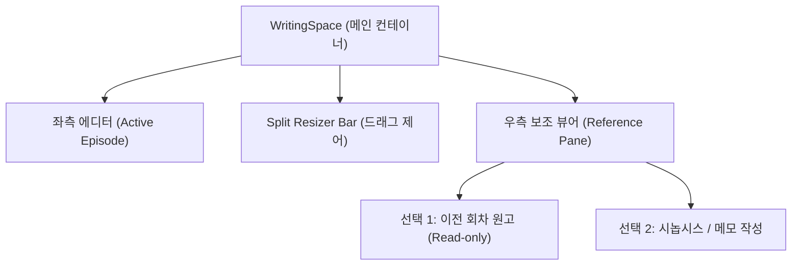

# Novelflow 상세 기능 구현 계획 및 개발 로드맵
(Detailed Function Implementation Plan and Development Roadmap)

이 문서는 노벨플로우(Novelflow)의 미구현 및 목(Mock)업 기능들을 실제 상용 서비스 스펙으로 구축하기 위한 아키텍처, 데이터베이스 DDL 스키마, 컴포넌트 설계 및 검증 계획을 정의하는 영구 보존용 개발 명세서입니다.

---

## 1. 집필실 에디터 (WritingSpace) 고도화

현재 단일 에디터 캔버스 구조인 집필실을 한국 웹소설 작가의 작업 연속성과 집필 편의에 맞춰 다각도로 보강합니다.

### 1.1 시놉시스 및 전편 에피소드 분할 뷰어 (Split-pane Layout)
* **목적**: 한 화면에서 두 개의 문서를 동시에 비교·확인하며 집필할 수 있는 기능입니다.
* **주요 UI/UX 설계**:
  - 에디터 하단 또는 상단 툴바에 "화면 분할(Split View)" 토글 버튼 추가.
  - 토글 활성화 시, 현재 화면을 `flex flex-row` 형태로 5:5 분할하여 오른쪽에 **보조 뷰어 패널(Read-only 또는 Edit 선택 가능)**을 렌더링.
  - 좌우 패널 사이에 마우스 드래그로 조절 가능한 **Split Bar** 배치 (`onMouseDown` 이벤트 감지 후 `document.addEventListener('mousemove')`를 통해 좌우 `flex-basis` 비율 실시간 조절).
  - 보조 패널에는 드롭다운 메뉴를 띄워 "시놉시스/메모 읽기" 또는 "다른 회차 원고 로드"를 선택할 수 있게 바인딩.



---

### 1.2 Supabase Edge Function 기반 한국어 맞춤법 검사기
* **목적**: 한글 문법 및 띄어쓰기 규격 오류를 에디터 내에서 실시간 감지하여 자동 교정을 돕습니다.
* **통신 아키텍처**:
  - 클라이언트가 에디터 내부의 텍스트 본문(HTML/Plain text)을 수집하여 `POST /functions/v1/spellcheck` Edge Function 호출.
  - Edge Function 내부에서 공신력 있는 맞춤법 검사기 게이트웨이(예: 부산대학교 맞춤법 검사기 API 또는 국립국어원 규격)와 통신하여 오탈자, 대치 단어(Suggestion), 교정 사유를 포함한 JSON 배열을 응답.
* **인라인 하이라이팅 및 툴팁 인터랙션**:
  - 응답받은 에러 목록의 인덱스 범위를 역순(`reverse()`)으로 추적하여, 에디터 `contentEditable` DOM의 해당 위치에 `<span class="spell-error border-b-2 border-red-500 border-dotted cursor-pointer" data-correct="교정단어" data-reason="교정사유">` 스타일 태그를 동적 주입.
  - 마우스를 올리거나 클릭 시 오류 설명 툴팁을 팝업하고, "교정 제안 단어" 클릭 시 해당 DOM 노드를 교정된 텍스트 노드로 즉시 치환.

---

### 1.3 플랫폼 규제 전용 금칙어 및 은어 사전 필터링
* **목적**: 네이버 시리즈, 카카오페이지 등의 심의 규정에 어긋나는 욕설, 선정적 표현, 비하 발언을 사전에 에디터에서 식별하여 작가에게 가이드를 제공합니다.
* **기술 사양**:
  - 금칙어 목록(Trie 자료구조화하여 `O(N)` 속도로 스캔)을 담은 로컬 JSON 사전(`censored_words.json`) 구축.
  - 사용자가 입력을 멈춘 후 500ms 디바운스 타이머를 거쳐 에디터 전체 텍스트에 대해 정규식 검색 수행.
  - 검출된 은어/금칙어 구절에 노란색 형광 배경 및 가이드 툴팁 적용 (예: *"이 단어는 플랫폼 가이드상 15세 이용가 연재 시 경고 대상이 될 수 있습니다."*).

---

### 1.4 프로젝트 단위 전체 글로벌 검색 및 일괄 치환 (Global Search & Replace)
* **목적**: 현재 작성 중인 회차뿐만 아니라 전체 에피소드(1화 ~ 100화)를 아우르는 전역 텍스트 탐색 및 일괄 이름 변경(치환) 기능입니다.
* **구현 세부사항**:
  - 집필실 사이드바 상단에 "글로벌 검색(Ctrl+Shift+F)" 모달 또는 전용 서브 탭 마련.
  - 입력한 검색어에 대해 전체 에피소드 배열(`episodes`)을 순회하며 일치 항목 추출.
  - 검색 결과 목록을 회차별 카드 형태로 렌더링하고, 각 카드 클릭 시 해당 에피소드로 화면을 전환하며 해당 단어로 스크롤/포커스 이동.
  - "일괄 치환" 버튼 클릭 시, 매칭된 모든 에피소드의 content 내에서 해당 단어를 새로운 단어로 일괄 `replace`하고 데이터베이스(Supabase) 및 LocalStorage에 일괄 트랜잭션 업데이트 수행.

---

### 1.5 에디터 사이드 설정 백과 퀵-가이드 링크
* **목적**: 에디터에 캐릭터 이름이나 중요 키워드(예: "검은 열쇠")를 타이핑하면, 우측 사이드 패널에 해당 설정 정보가 실시간 퀵뷰로 나타납니다.
* **구현 방식**:
  - 현재 활성화된 에피소드 본문 내에서 기존 설정 백과(관계도 노드 및 세계관 핀 정보)에 등록된 고유 명사를 정규식으로 실시간 매칭.
  - 매칭된 명칭이 감지되면 에디터 우측 미니 위젯 영역에 해당 캐릭터의 이미지, 기본 프로필(나이, 경지), 주요 복선 요약 카드를 슬라이드 인 애니메이션과 함께 노출.

---

## 2. 인터랙티브 세계관 지도 편집기 (World Map)

현재 정적 SVG 목업으로 동작하는 세계관 지도를 Leaflet.js를 결합한 실시간 지도 제작 스튜디오로 전환합니다.

```
[세계관 지도 편집기 (Leaflet.js CRS.Simple)]
  ├── 배경 지도: 사용자 업로드 고해상도 판타지 지도 이미지
  ├── 드로잉 레이어 (Leaflet-Geoman):
  │     ├── 영역 (Polygon): 영토 설정, 색상 채우기, 불투명도 조절
  │     ├── 경로 (Polyline): 군대 이동 경로, 캐릭터 여행 동선
  │     └── 포인트 (Marker): 요새, 도시, 포털 등 핀 꽂기 및 아이콘 편집
  └── 서사 축 타임라인 슬라이더: 회차 변동에 따른 지도 레이아웃 상태 변경 연동
```

### 2.1 Leaflet.js 가상 좌표계 편집기 구축
* **기술 사양**:
  - 지리적 지도가 아닌 판타지 세계관 가상 지도 이미지를 불러와야 하므로, Leaflet의 `L.CRS.Simple` 가상 좌표계 모델을 마운트.
  - 사용자가 자신만의 지도 이미지(PNG/JPEG)를 업로드하면 이를 캔버스 배경으로 설정하고 가상 픽셀 크기에 비례하여 줌(Zoom)/팬(Pan) 한계를 보정.
  - 꼭짓점 편집 및 자유 드로잉이 지원되는 `Leaflet-Geoman` 패키지를 연동하여 폴리곤(영토 구분선), 폴리라인(국경선/국도선), 마커(도시/요새)를 지도 캔버스상에서 마우스 클릭만으로 쉽게 그리고 편집할 수 있게 제공.
* **데이터 모델**:
  - 지도상에 그려진 모든 요소의 속성을 GeoJSON 구조로 가공하여 PostgreSQL `world_maps` 및 `map_elements` 테이블에 싱크.

### 2.2 시점 슬라이더 기반 영토/세력 시각 변천사
* **구현 메커니즘**:
  - 각 지도 요소(폴리곤, 마커) 생성 시 `active_episode_start_id`와 `active_episode_end_id` 필드를 부여하여, 해당 요소가 존재하는 소설 속 시간적 유효 범위를 설정.
  - 지도 하단의 타임라인 슬라이더 조작 시, 선택한 회차 ID에 부합하는 활성 요소들만 필터링하여 지도상에 동적으로 표출.
  - 예: "동부 요새 함락 사건" 회차 이후로 타임라인 슬라이더를 옮기면, "동부 국경 요새" 핀 마커의 시각적 불투명도가 낮아지며 "제국 영토(적색 폴리곤)"의 영역 경계가 왕국 방향으로 침범하도록 실시간 SVG 폴리곤 좌표 보간 애니메이션 작동.

---

## 3. 복선 타임라인 (Foreshadowing Timeline)

단순 정적 목록에서 벗어나 소설 전체 플롯의 완성도를 높이고 독자의 흥미를 유발할 '복선 자동 회수 알림기'를 구체화합니다.

### 3.1 복선 관리 시스템 구현
* **데이터 스키마 사양**:
  - `foreshadowings` 테이블 구조: `id`, `project_id`, `title`, `description`, `plant_episode_id` (회차 심은 시점), `target_payoff_episode_id` (목표 회수 시점), `actual_payoff_episode_id` (실제 회수 시점), `status` ('planted' | 'developed' | 'paid_off').
* **상태 전이 칸반 보드**:
  - 사용자는 복선 관리 탭에서 드래그 앤 드롭 방식으로 복선 카드의 상태를 변경하거나 수동 회차를 매핑 가능.

### 3.2 에디터 연동 미회수 복선 경고 알림 (Plot Hole Guard)
* **로직 설계**:
  - 작가가 집필실에서 신규 회차를 편집하여 저장할 때, 백엔드/로컬 상태에서 해당 프로젝트의 복선 중 `status !== 'paid_off'` 이고 `target_payoff_episode_id`가 현재 작성 중인 회차보다 이전인 항목이 존재하는지 전수 분석.
  - 설정된 회수 한계 회차를 초과했음에도 회수 처리가 되지 않은 복선이 감지되면 에디터 우측 상단에 **`[⚠️ 복선 회수 지연 경고]`** 배지를 표시하고 알림 패널을 활성화.
  - 알림 패널에는 *"제 10화에 심은 '황금 열쇠의 비밀' 복선이 목표 회차(제 50화)에 도달했으나 아직 회수되지 않았습니다. 현재 회차에서 회수 플롯을 전개하거나 목표 회차를 조정하십시오."* 라는 정교한 가이드 텍스트 노출.

---

## 4. 캐릭터 히스토리 (Character History)

각 등장인물의 서사 흐름, 외모/지위 변화, 그리고 사건에 따른 아크 성장 추적 시스템을 구축합니다.

### 4.1 인물 정보 연동 회차별 로그 캘린더
* **구현 방식**:
  - `character_history_logs` 테이블 정의: `id`, `character_id`, `episode_id`, `title`, `description` (예: "영혼 각성", "마탑 입문", "기사 서임식").
  - 캐릭터 프로필 카드 내에 "연대기(History)" 탭을 추가하고, 회차와 연결된 핵심 사건 리스트를 연표 형식의 타임라인 컴포넌트로 시각화.
  - 집필실 에디터 본문에서 맞춤법 및 명사 감지를 통해 특정 캐릭터의 이름이 자주 등장하는 회차를 추출해, 시스템이 인물의 실시간 이동 경로 및 참여 에피소드를 자동으로 추천 매핑.

### 4.2 시간 연대표 기반 나이/위치 자동 연산
* **로직 설계**:
  - 프로젝트 설정에서 기본 작중 시작 연도(예: "제국력 932년")를 지정하고, 각 에피소드 생성 시 발생 시점(예: "시작일로부터 +180일" 또는 "제국력 932년 10월")을 바인딩.
  - 캐릭터 프로필에 "출생 연도"를 기입해 두면, 작가가 임의의 에피소드를 선택해 열람할 때 해당 에피소드의 시간 정보와 연동하여 **해당 시점 캐릭터의 나이 및 활약 상태**를 자동으로 역산 출력.

---

## 5. 노션 양방향 실시간 동기화 (Notion Sync) - 구현 시도 후 폐기

*   **히스토리**: 클라이언트의 설정 데이터가 노션 데이터베이스 백과 및 위키 페이지와 완전 동기화되는 OAuth 기반 커넥터를 활성화하고자 기획을 구상했습니다.
*   **폐기 사유**: 노션 API의 브라우저 상 CORS 제약 사항, Deno Edge Functions 배포 보안 한계, 로컬 샌드박스의 리다이렉트 서버 관리 이슈로 인해 실제로 구현을 진행했으나 최종 폐기 처리되었습니다. 양방향 동기화 및 문서 가져오기 대신 순수 PC 환경의 로컬 다중 파일 및 계층 폴더 가져오기(Recursive Local Import) 기능만 완수하여 지원합니다.

---

## 6. 데이터베이스 테이블 추가 DDL 기획안

이상의 고도화 기능을 뒷받침하기 위해 Supabase에 마이그레이션 적용할 PostgreSQL DDL 구조입니다.

```sql
-- A. 세계관 지도 테이블
CREATE TABLE world_maps (
    id UUID PRIMARY KEY DEFAULT gen_random_uuid(),
    project_id UUID NOT NULL REFERENCES projects(id) ON DELETE CASCADE,
    name VARCHAR(255) NOT NULL,
    image_url TEXT, -- 사용자 업로드 지도 배경 이미지
    created_at TIMESTAMP WITH TIME ZONE DEFAULT timezone('utc'::text, now()) NOT NULL
);

CREATE TABLE map_elements (
    id UUID PRIMARY KEY DEFAULT gen_random_uuid(),
    map_id UUID NOT NULL REFERENCES world_maps(id) ON DELETE CASCADE,
    name VARCHAR(100) NOT NULL,
    type VARCHAR(20) NOT NULL, -- 'polygon', 'polyline', 'pin'
    color VARCHAR(10) DEFAULT '#5E6AD2',
    opacity NUMERIC(3,2) DEFAULT 0.3,
    geojson_data JSONB NOT NULL, -- 지리적 좌표 및 그리기 메타데이터 저장
    active_episode_start_id UUID, -- 등장하기 시작하는 에피소드 ID
    active_episode_end_id UUID, -- 소멸/함락 등으로 사라지는 에피소드 ID
    created_at TIMESTAMP WITH TIME ZONE DEFAULT timezone('utc'::text, now()) NOT NULL
);

-- B. 복선 타임라인 테이블
CREATE TABLE foreshadowings (
    id UUID PRIMARY KEY DEFAULT gen_random_uuid(),
    project_id UUID NOT NULL REFERENCES projects(id) ON DELETE CASCADE,
    title VARCHAR(255) NOT NULL,
    description TEXT,
    plant_episode_id UUID NOT NULL, -- 복선을 심은 회차
    target_payoff_episode_id UUID NOT NULL, -- 복선을 회수해야 할 목표 한계 회차
    actual_payoff_episode_id UUID, -- 실제 회수한 회차 (Paid Off 상태 시 입력)
    status VARCHAR(20) DEFAULT 'planted' NOT NULL, -- 'planted', 'developed', 'paid_off'
    created_at TIMESTAMP WITH TIME ZONE DEFAULT timezone('utc'::text, now()) NOT NULL
);

-- C. 캐릭터 연대기 및 역사 로그 테이블
CREATE TABLE character_history_logs (
    id UUID PRIMARY KEY DEFAULT gen_random_uuid(),
    character_id VARCHAR(50) NOT NULL, -- relationNodes 내 캐릭터 id 매핑
    episode_id UUID NOT NULL, -- 사건이 발생한 회차
    title VARCHAR(255) NOT NULL, -- 사건 내용 핵심 (예: "기사 임명")
    description TEXT, -- 세부 설명
    location_pin_id UUID REFERENCES map_elements(id) ON DELETE SET NULL, -- 사건 발생 지도 핀 연동
    created_at TIMESTAMP WITH TIME ZONE DEFAULT timezone('utc'::text, now()) NOT NULL
);
```
