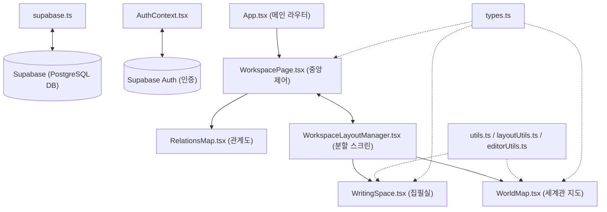

# 노벨플로우(Novelflow) 시스템 아키텍처 통합 명세서
(Global System Architecture, Directory Relations, File Dependency Specifications, and Database Schemas)

이 문서는 노벨플로우(Novelflow) 서비스의 전체 개발 환경 스택, 클라이언트 소스 파일 구조 및 컴포넌트 간 상호 의존 관계(어떤 파일을 사용하고 어디서 사용되는지), 그리고 PostgreSQL 기반 데이터베이스 스키마 설계 규격을 설명하는 시스템 마스터 엔지니어링 문서입니다.

---

## 1. 개발 기술 스택 (Technology Stack Spec)

### 1-0. 오픈 소스 라이브러리 활용 지침
*   **원칙**: 새로운 기능을 구현하거나 개편을 요구받을 경우 무조건 제로 베이스에서 처음부터 직접 만들기보다, 인터넷 조사와 분석을 통해 이미 구현된 오픈 소스 라이브러리가 있는지 확인하고 적극 활용한다.
*   **상업적 무료 이용 필수**: 라이브러리는 반드시 무료로 상업적 이용(Commercial Use)이 가능한 오픈 소스 라이선스(MIT, Apache 2.0 등)여야 한다.
*   **사전 고지 조항**: 만약 라이브러리 이용 조건에 저작권자 표기(Attribution)나 특수한 소스코드 공개 의무 등이 수반될 경우, 반드시 실제 적용 및 구현을 진행하기 전에 사용자에게 관련 조건을 상세히 설명하고 동의를 얻어야 한다.

### 1-1. 클라이언트 및 데스크톱 스택
*   **Tauri (Rust + React / TypeScript)**: 데스크톱 기반 Always-on-Top 미니 위젯 런타임을 구동하는 경량 바이너리 프레임워크.
*   **React & Tailwind CSS (v4)**: 고성능 SPA 클라이언트 렌더링 및 모던 글래스모피즘 UI 스타일링 정의.
*   **Supabase Client SDK**: BaaS 데이터 레이어와 클라이언트 간의 직접 데이터 트랜잭션 수립.
*   **Leaflet.js & Leaflet-Geoman (react-leaflet)**: 가상 좌표계(`CRS.Simple`) 기반 대형 지도 캔버스 핸들링 및 다각형(영역), 선(경로), 꼭짓점 드로잉 지원.
*   **html2canvas / leaflet-image**: 브라우저 상의 지도를 고해상도 PNG 이미지 파일로 클라이언트 캡처 및 익스포트.
*   **Zustand**: 계층형 지도 노드 트리 정보 및 타임라인 동적 스냅샷 이동용 경량 전역 상태 관리 라이브러리.

### 1-2. 백엔드 및 BaaS (Supabase) 스택
*   **Supabase Database (PostgreSQL / pgvector)**: 원고 에피소드 저장, 캐릭터 설정 및 RAG용 임베딩 데이터(pgvector) 통합 관리.
*   **Supabase Realtime**: Tauri 데스크톱 위젯과 웹 브라우저 에디터 간의 작성 내용 실시간 데이터 양방향 싱크.
*   **Supabase Edge Functions (Deno / TypeScript)**: 외부 API(Notion, 맞춤법 검사, AI 작명 등)와의 연동 및 결제 웹훅 수신을 위한 서버리스 로직 실행.
*   **Supabase Auth**: 소셜 및 게스트 가상 계정 로그인 제공.

---

## 2. 프로젝트 파일별 상세 명세 & 의존 관계 (File Dependencies & Relations)

노벨플로우의 모든 소스 파일에 대한 **역할 설명**, **어떤 파일을 사용하는지(Imports/Dependencies)**, **어떤 파일에서 사용되는지(Used By/Dependents)**에 대한 세부 명세입니다.

---

### 2-1. 코어 및 엔트리 포인트 (Root & Core)

#### `src/main.tsx`
- **역할**: React 애플리케이션 마운트 진입점. DOM 루트에 `App` 컴포넌트를 마운트함.
- **어떤 파일을 사용**: `src/App.tsx`, `src/index.css`
- **어떤 파일에서 사용됨**: `index.html` (Vite 번들러)

#### `src/App.tsx`
- **역할**: 최상위 라우터 및 글로벌 레이아웃 컨테이너. 라우팅 경로(`/`, `/login`, `/signup`, `/app`, `/info`) 제어 및 AlertConfirmContext 래핑.
- **어떤 파일을 사용**: `src/pages/LoginPage.tsx`, `src/pages/SignupPage.tsx`, `src/pages/AppPage.tsx`, `src/pages/InfoPage.tsx`, `src/components/ProtectedRoute.tsx`, `src/components/Header.tsx`, `src/components/Hero.tsx`, `src/components/Features.tsx`, `src/components/Footer.tsx`, `src/context/AuthContext.tsx`, `src/context/AlertConfirmContext.tsx`
- **어떤 파일에서 사용됨**: `src/main.tsx`

#### `src/index.css`
- **역할**: 앱 전역 CSS 가이드라인. 다크 모드 색상 토큰, custom scrollbar, glassmorphism 스타일 정의.
- **어떤 파일을 사용**: 외부 Google Fonts (Inter, Outfit 등)
- **어떤 파일에서 사용됨**: `src/main.tsx`

#### `src/App.css`
- **역할**: 공통 유틸리티 애니메이션 및 레이아웃 보조 스타일 정의.
- **어떤 파일을 사용**: 없음
- **어떤 파일에서 사용됨**: `src/App.tsx`

---

### 2-2. 공통 라이브러리 및 컨텍스트 (Lib & Context)

#### `src/lib/supabase.ts`
- **역할**: Supabase Client SDK 초기화 인스턴스 싱글톤.
- **어떤 파일을 사용**: `@supabase/supabase-js`
- **어떤 파일에서 사용됨**: `src/context/AuthContext.tsx`, `src/pages/LoginPage.tsx`, `src/pages/SignupPage.tsx`, `src/pages/WorkspacePage.tsx`

#### `src/lib/fonts.ts`
- **역할**: Google Fonts 웹 폰트 동적 로드 및 집필 에디터용 커스텀 폰트 리스트 제공.
- **어떤 파일을 사용**: 없음
- **어떤 파일에서 사용됨**: `src/components/workspace/WritingSpace.tsx`, `src/components/workspace/writingspace/EditorToolbar.tsx`

#### `src/context/AuthContext.tsx`
- **역할**: Supabase Auth 로그인 세션 상태 및 게스트 우회 계정(`guest-user-id`)을 관리하는 전역 컨텍스트 Provider.
- **어떤 파일을 사용**: `src/lib/supabase.ts`
- **어떤 파일에서 사용됨**: `src/App.tsx`, `src/components/ProtectedRoute.tsx`, `src/components/Header.tsx`, `src/components/Sidebar.tsx`, `src/pages/LoginPage.tsx`, `src/pages/SignupPage.tsx`, `src/pages/WorkspacePage.tsx`

#### `src/context/AlertConfirmContext.tsx`
- **역할**: 브라우저 기본 alert/confirm 대신 제공되는 모던 UI 모달 알림 및 대화상자 전역 Provider.
- **어떤 파일을 사용**: `lucide-react`
- **어떤 파일에서 사용됨**: `src/App.tsx`, `src/pages/WorkspacePage.tsx`, `src/components/workspace/WritingSpace.tsx`, `src/components/workspace/WorldMap.tsx` 등 다수 컴포넌트

---

### 2-3. 커스텀 훅 (Custom Hooks)

#### `src/hooks/useEditorFormat.ts`
- **역할**: 집필 에디터 텍스트 포맷팅(굵게, 기울임, 밑줄, 취소선, 글자색, 배경색, 정렬, 폰트크기, 폰트패밀리, 구분선 등) 로직을 전담하는 커스텀 훅.
- **어떤 파일을 사용**: `src/components/workspace/writingspace/editorUtils.ts`
- **어떤 파일에서 사용됨**: `src/components/workspace/WritingSpace.tsx`, `src/components/workspace/writingspace/EditorToolbar.tsx`

#### `src/hooks/useEpisodes.ts`
- **역할**: 원고 에피소드 회차 목록 CRUD, 순서 변경, 삭제 및 휴지통 복원 비즈니스 로직 훅.
- **어떤 파일을 사용**: `src/components/workspace/types.ts`
- **어떤 파일에서 사용됨**: `src/components/workspace/WritingSpace.tsx`, `src/components/workspace/writingspace/EpisodeSidebar.tsx`

---

### 2-4. 페이지 라우트 컴포넌트 (Pages)

#### `src/pages/LoginPage.tsx`
- **역할**: 이메일/비밀번호 로그인 및 소셜/게스트 게이트웨이 화면.
- **어떤 파일을 사용**: `src/lib/supabase.ts`, `src/context/AuthContext.tsx`
- **어떤 파일에서 사용됨**: `src/App.tsx`

#### `src/pages/SignupPage.tsx`
- **역할**: 이메일 기반 회원가입 폼 처리 화면.
- **어떤 파일을 사용**: `src/lib/supabase.ts`, `src/context/AuthContext.tsx`
- **어떤 파일에서 사용됨**: `src/App.tsx`

#### `src/pages/AppPage.tsx`
- **역할**: 인증을 마친 사용자가 접근하는 작업대 래퍼 페이지. `WorkspacePage`에 초기 프로젝트 상태 전송.
- **어떤 파일을 사용**: `src/pages/WorkspacePage.tsx`, `src/context/AuthContext.tsx`
- **어떤 파일에서 사용됨**: `src/App.tsx`

#### `src/pages/WorkspacePage.tsx`
- **역할**: **애플리케이션의 핵심 데이터 총괄 브레인.** 프로젝트/에피소드/등장인물/세계관 지도/복선 데이터를 관리하고 각 지원 서브 도구 탭으로 데이터 Props 배포.
- **어떤 파일을 사용**: `src/components/Sidebar.tsx`, `src/components/CreateProjectModal.tsx`, `src/components/MyPageModal.tsx`, `src/components/workspace/types.ts`, `src/components/workspace/ProjectDashboard.tsx`, `src/components/workspace/WritingSpace.tsx`, `src/components/workspace/AiNamingEngine.tsx`, `src/components/workspace/JamoFilter.tsx`, `src/components/workspace/RelationsMap.tsx`, `src/components/workspace/WorldMap.tsx`, `src/components/workspace/ForeshadowingTimeline.tsx`, `src/components/workspace/CharacterHistory.tsx`, `src/components/workspace/WorkspaceLayoutManager.tsx`, `src/context/AuthContext.tsx`, `src/context/AlertConfirmContext.tsx`
- **어떤 파일에서 사용됨**: `src/pages/AppPage.tsx`

#### `src/pages/InfoPage.tsx`
- **역할**: 노벨플로우 서비스 주요 기능 안내 및 사용법 설명 가이드 페이지.
- **어떤 파일을 사용**: `lucide-react`
- **어떤 파일에서 사용됨**: `src/App.tsx`

---

### 2-5. 공통 쉘 컴포넌트 (Components)

#### `src/components/ProtectedRoute.tsx`
- **역할**: 인증되지 않은 사용자의 `/app` 진입을 차단하고 `/login`으로 리다이렉트하는 게이트웨이 컴포넌트.
- **어떤 파일을 사용**: `src/context/AuthContext.tsx`
- **어떤 파일에서 사용됨**: `src/App.tsx`

#### `src/components/Sidebar.tsx`
- **역할**: 워크스페이스 좌측 네비게이션바. 창작 서브 도구 탭(집필실, 세계관 지도, 관계도 등) 상호 전환 컨트롤러.
- **어떤 파일을 사용**: `src/components/workspace/types.ts`, `src/context/AuthContext.tsx`
- **어떤 파일에서 사용됨**: `src/pages/WorkspacePage.tsx`

#### `src/components/CreateProjectModal.tsx`
- **역할**: 신규 소설 창작 프로젝트 생성 팝업 모달.
- **어떤 파일을 사용**: `src/components/workspace/types.ts`
- **어떤 파일에서 사용됨**: `src/pages/WorkspacePage.tsx`

#### `src/components/MyPageModal.tsx`
- **역할**: 마이페이지 프로필 설정 및 계정 정보 확인 모달.
- **어떤 파일을 사용**: `src/context/AuthContext.tsx`
- **어떤 파일에서 사용됨**: `src/pages/WorkspacePage.tsx`

#### `src/components/Header.tsx`, `Hero.tsx`, `Features.tsx`, `Footer.tsx`
- **역할**: 서비스 랜딩 페이지를 구성하는 레이아웃 컴포넌트군.
- **어떤 파일을 사용**: `src/context/AuthContext.tsx` (Header)
- **어떤 파일에서 사용됨**: `src/App.tsx`

---

### 2-6. 창작 지원 핵심 도구군 (Workspace Components)

#### `src/components/workspace/types.ts`
- **역할**: 프로젝트, 에피소드, 등장인물, 관계도 Node, 복선, 세계관 지도 `MapElement` 등 앱 전반 데이터 인터페이스 규격 정의.
- **어떤 파일을 사용**: 없음
- **어떤 파일에서 사용됨**: 프로젝트 내 거의 모든 `src/components/workspace/*` 컴포넌트

#### `src/components/workspace/utils.ts`
- **역할**: 한글 유니코드 초성/중성/종성 쪼개기 및 Levenshtein 편집 거리 알고리즘 기반 발음 유사도 분석 유틸리티.
- **어떤 파일을 사용**: 없음
- **어떤 파일에서 사용됨**: `src/components/workspace/AiNamingEngine.tsx`, `src/components/workspace/JamoFilter.tsx`

#### `src/components/workspace/layoutUtils.ts`
- **역할**: 집필실/세계관 지도 다중 분할 스크린(Split Screen) 레이아웃 구성 및 트리 구조 계산 유틸리티.
- **어떤 파일을 사용**: 없음
- **어떤 파일에서 사용됨**: `src/components/workspace/WorkspaceLayoutManager.tsx`

#### `src/components/workspace/WorkspaceLayoutManager.tsx`
- **역할**: 집필실 및 다양한 서브 도구 창을 좌/우, 상/하 분할하여 자유롭게 배치하고 리사이즈하는 화면 분할 제어기.
- **어떤 파일을 사용**: `src/components/workspace/layoutUtils.ts`, `src/components/workspace/WritingSpace.tsx`, `src/components/workspace/WorldMap.tsx` 등
- **어떤 파일에서 사용됨**: `src/pages/WorkspacePage.tsx`

#### `src/components/workspace/WritingSpace.tsx`
- **역할**: **리치 텍스트 소설 집필 환경 코어 컴포넌트.** 회차 사이드바, 포맷팅 툴바, 에디터 본문 캔버스, 검사기 및 버전 이력/찾기바꾸기 패널을 총괄 결합.
- **어떤 파일을 사용**: `src/hooks/useEditorFormat.ts`, `src/hooks/useEpisodes.ts`, `src/lib/fonts.ts`, `src/components/workspace/writingspace/EpisodeSidebar.tsx`, `src/components/workspace/writingspace/EditorToolbar.tsx`, `src/components/workspace/writingspace/MainEditorCanvas.tsx`, `src/components/workspace/writingspace/EditorInspector.tsx`, `src/components/workspace/writingspace/FindReplaceBar.tsx`, `src/components/workspace/writingspace/DiffViewPane.tsx`, `src/components/workspace/writingspace/Modals/*`
- **어떤 파일에서 사용됨**: `src/pages/WorkspacePage.tsx`, `src/components/workspace/WorkspaceLayoutManager.tsx`

#### `src/components/workspace/WorldMap.tsx`
- **역할**: **인터랙티브 세계관 지도 시스템 컴포넌트.** 시점 슬라이더 스냅샷, 원형/네모 붓 칠하기(획 단위 두께/모양 보존), 다각형 영역, 경로선, 핀 거점 drag, 사이드바 트리 drag&drop, 그룹 흡수/중첩 계층 연산 제공.
- **어떤 파일을 사용**: `src/components/workspace/types.ts`, `src/context/AlertConfirmContext.tsx`, `src/context/AuthContext.tsx`, `lucide-react`
- **어떤 파일에서 사용됨**: `src/pages/WorkspacePage.tsx`, `src/components/workspace/WorkspaceLayoutManager.tsx`

#### `src/components/workspace/ProjectDashboard.tsx`
- **역할**: 소설 기본 정보 요약, 회차별 분량 그래프 통계 및 아이디어 메모장(디바운싱 로컬 캐싱).
- **어떤 파일을 사용**: `src/components/workspace/types.ts`
- **어떤 파일에서 사용됨**: `src/pages/WorkspacePage.tsx`

#### `src/components/workspace/AiNamingEngine.tsx`
- **역할**: 소설 등장인물 및 지명 추천 AI 작명 엔진. 자모 유사도 사전 필터링 탑재.
- **어떤 파일을 사용**: `src/components/workspace/utils.ts`, `src/components/workspace/types.ts`
- **어떤 파일에서 사용됨**: `src/pages/WorkspacePage.tsx`

#### `src/components/workspace/JamoFilter.tsx`
- **역할**: 등장인물 간 이름 발음 자모 비교 및 충돌 분석 시각화 도구.
- **어떤 파일을 사용**: `src/components/workspace/utils.ts`, `src/components/workspace/types.ts`
- **어떤 파일에서 사용됨**: `src/pages/WorkspacePage.tsx`

#### `src/components/workspace/RelationsMap.tsx`
- **역할**: 인물 간 관계를 2D 캔버스 위 마우스 드래그 배치 및 SVG 커스텀 관계선 연결 시각화 도구.
- **어떤 파일을 사용**: `src/components/workspace/types.ts`
- **어떤 파일에서 사용됨**: `src/pages/WorkspacePage.tsx`

#### `src/components/workspace/ForeshadowingTimeline.tsx`
- **역할**: 소설 회차별 미회수 복선 등록 및 회수 현황 추적 타임라인.
- **어떤 파일을 사용**: `src/components/workspace/types.ts`
- **어떤 파일에서 사용됨**: `src/pages/WorkspacePage.tsx`

#### `src/components/workspace/CharacterHistory.tsx`
- **역할**: 에피소드 진행 단계별 인물 등장 및 이력 로그 추적 컴포넌트.
- **어떤 파일을 사용**: `src/components/workspace/types.ts`
- **어떤 파일에서 사용됨**: `src/pages/WorkspacePage.tsx`

---

### 2-7. 집필실 세부 컴포넌트 및 서브 모달 (Writingspace Sub-Components)

#### `src/components/workspace/writingspace/editorUtils.ts`
- **역할**: 에디터 내 텍스트 카운팅, 맞춤법/치환, 포맷팅 지원 헬퍼 함수 정의.
- **어떤 파일을 사용**: 없음
- **어떤 파일에서 사용됨**: `src/hooks/useEditorFormat.ts`, `src/components/workspace/WritingSpace.tsx`

#### `src/components/workspace/writingspace/EpisodeSidebar.tsx`
- **역할**: 에피소드 목록 트리, 폴더 구분, 회차 순서 드래그 재배치 사이드바.
- **어떤 파일을 사용**: `src/hooks/useEpisodes.ts`, `src/components/workspace/types.ts`
- **어떤 파일에서 사용됨**: `src/components/workspace/WritingSpace.tsx`

#### `src/components/workspace/writingspace/EditorToolbar.tsx`
- **역할**: 폰트, 서식, 서브 모달 팝업 등을 제어하는 에디터 상단 통합 서식 툴바.
- **어떤 파일을 사용**: `src/hooks/useEditorFormat.ts`, `src/lib/fonts.ts`
- **어떤 파일에서 사용됨**: `src/components/workspace/WritingSpace.tsx`

#### `src/components/workspace/writingspace/MainEditorCanvas.tsx`
- **역할**: 집필실 본문 텍스트 입력 및 수동/자동 커서 포커스 캔버스 뷰.
- **어떤 파일을 사용**: 없음
- **어떤 파일에서 사용됨**: `src/components/workspace/WritingSpace.tsx`

#### `src/components/workspace/writingspace/EditorInspector.tsx`
- **역할**: 우측 원고 글자수 통계, 폰트 정보, 스냅샷 버전 이력 및 맞춤법 검사 패널.
- **어떤 파일을 사용**: `src/components/workspace/types.ts`
- **어떤 파일에서 사용됨**: `src/components/workspace/WritingSpace.tsx`

#### `src/components/workspace/writingspace/FindReplaceBar.tsx`
- **역할**: 원고 본문 텍스트 찾기 및 일괄 바꾸기 검색바.
- **어떤 파일을 사용**: 없음
- **어떤 파일에서 사용됨**: `src/components/workspace/WritingSpace.tsx`

#### `src/components/workspace/writingspace/DiffViewPane.tsx`
- **역할**: 스냅샷 버전 간 원고 수정 내역 변경점 비교(Diff) 페인.
- **어떤 파일을 사용**: 없음
- **어떤 파일에서 사용됨**: `src/components/workspace/WritingSpace.tsx`

#### `src/components/workspace/writingspace/Modals/` (서브 모달 9종)
- `AutoSaveModal.tsx`: 자동 저장 간격 및 조건 설정 모달
- `CreateCustomDividerModal.tsx`: 사용자 정의 에디터 구분선 디자인 모달
- `DividerConfigModal.tsx`: 기존 구분선 스타일 변경 모달
- `LinkInsertModal.tsx`: 텍스트 하이퍼링크 주소 삽입 모달
- `LocalImportModal.tsx`: 외부 TXT/원고 파일 들여오기 모달
- `SnapshotHistoryModal.tsx`: 스냅샷 이력 복원/비교 모달
- `SnapshotInputModal.tsx`: 수동 스냅샷 메모 입력 모달
- `TableInsertModal.tsx`: 에디터 본문 내 표(Table) 구획 삽입 모달
- `TrashModal.tsx`: 삭제된 에피소드 휴지통 복구 팝업 모달
- **어떤 파일에서 사용됨**: `src/components/workspace/WritingSpace.tsx`

---

## 3. 데이터 흐름 및 Mermaid 다이어그램



---

## 4. 데이터베이스 및 서버리스 설계 (Database Schema & API Design)

### 4-1. PostgreSQL DDL 테이블 정의서
```sql
-- pgvector 익스텐션 활성화 (RAG 벡터 검색용)
CREATE EXTENSION IF NOT EXISTS vector;

-- 1. 사용자 프로필 테이블
CREATE TABLE IF NOT EXISTS public.profiles (
    id UUID PRIMARY KEY REFERENCES auth.users(id) ON DELETE CASCADE,
    email TEXT NOT NULL,
    display_name TEXT,
    created_at TIMESTAMPTZ DEFAULT NOW(),
    updated_at TIMESTAMPTZ DEFAULT NOW()
);

-- 2. 프로젝트 테이블
CREATE TABLE IF NOT EXISTS public.projects (
    id UUID PRIMARY KEY DEFAULT gen_random_uuid(),
    user_id UUID NOT NULL REFERENCES public.profiles(id) ON DELETE CASCADE,
    title TEXT NOT NULL,
    genre TEXT,
    description TEXT,
    created_at TIMESTAMPTZ DEFAULT NOW(),
    updated_at TIMESTAMPTZ DEFAULT NOW()
);

-- 3. 에피소드 원고 테이블
CREATE TABLE IF NOT EXISTS public.episodes (
    id UUID PRIMARY KEY DEFAULT gen_random_uuid(),
    project_id UUID NOT NULL REFERENCES public.projects(id) ON DELETE CASCADE,
    title TEXT NOT NULL,
    content TEXT DEFAULT '',
    order_index INT DEFAULT 0,
    created_at TIMESTAMPTZ DEFAULT NOW(),
    updated_at TIMESTAMPTZ DEFAULT NOW()
);
```

이 문서는 개발 및 리팩토링 진행 시 모든 소스 파일의 위치와 상호 의존 관계의 지침서로 활용됩니다.
